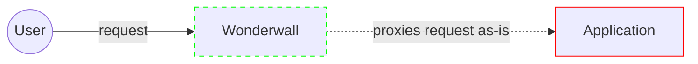
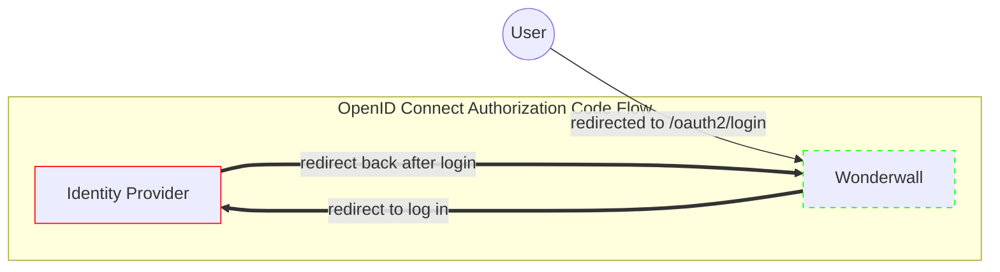
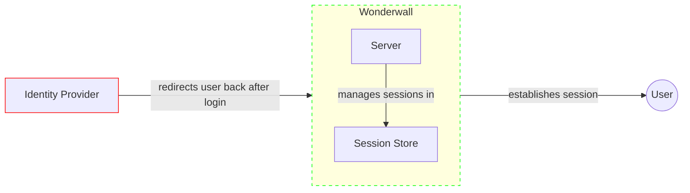
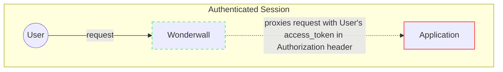
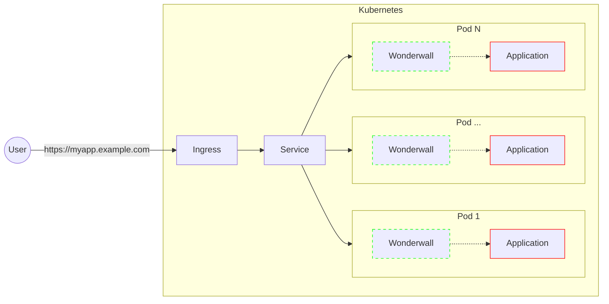
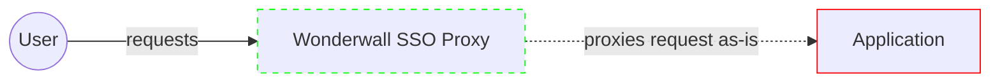
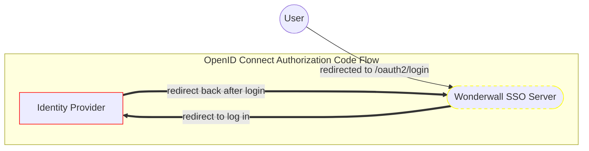
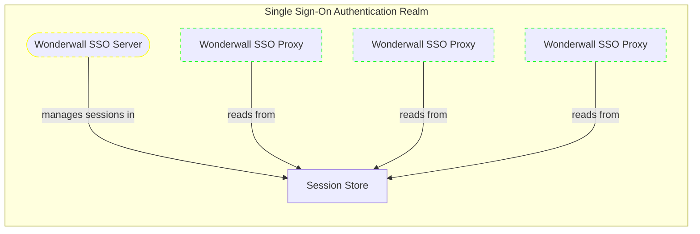
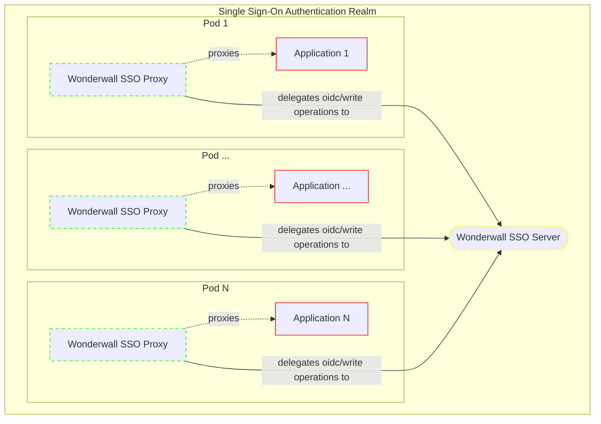

# Architecture

Wonderwall is a reverse-proxy that sits in front of your application:

It handles the OpenID Connect Auth Code flow with an identity provider...

...as well as session management...

...so that your application can focus on serving requests:

## Kubernetes Setup

Wonderwall is primarily designed to be deployed as a _sidecar_ container in Kubernetes. An example setup could look like this:

Note that we do not provide any mechanisms to configure `Services` or inject the sidecar into `Deployments` at this time; this is left as an exercise for the reader.

# Modes

Wonderwall has two runtime modes, the choice of which depends on your specific setup:

1. The _Standalone mode_ is the default mode and is the most restrictive.
2. The _Single Sign-On (SSO) mode_ is an optional mode where the restrictions are loosened.

## Standalone Mode (Default)

The standalone mode is the default mode for Wonderwall and the most restrictive mode.
It encourages a 1-to-1 mapping for a single identity provider client to a upstream application, where each application has their own identity provider client (i.e. their own set of credentials, their own set of redirect URLs, etc.)

This mode is suitable for organizations seeking to implement zero-trust based token architectures, but requires some maturity in terms of automated provisioning and configuration of identity provider clients.

Restrictions:

- Cookies are set to the match the most specific domain and path (if any) for the configured `ingress`.
- Allowed redirects are also similarly restricted to the same domain and path.
- Users will have separate sessions for each application.
  - If using an identity provider with SSO capabilities, this means that the user will see a "redirect blip" when navigating between applications. This may be undesirable in terms of user experience, which is an unfortunate trade-off for increased security.
  - If you want sessions to be seamlessly shared between applications on a common domain, use Wonderwall in [SSO mode](#single-sign-on-sso-mode).

Generally speaking, the recommended approach when using Wonderwall in standalone mode is to put it in front of your backend-for-frontend server that serves your frontend.
Requests to other APIs should be done through the backend-for-frontend by reverse-proxying.
This avoids having to configure CORS as well as the restrictions on cookies and allowed redirects mandated by Wonderwall.

See the [configuration](configuration.md#standalone-mode-default) document for configuring the standalone mode.

## Single Sign-On (SSO) Mode

The single sign-on mode is an optional mode where some restrictions are loosened, compared to the standalone mode.

The most notable changes are:

- Session cookies are now set and accessible for the whole SSO (sub-)domain that is configured.
- The [`/oauth2/session`](endpoints.md#oauth2session) and [`/oauth2/session/refresh`](endpoints.md#oauth2sessionrefresh) endpoints are configured to allow CORS from origins matching the SSO (sub-)domain.
- [Automatic token refreshes are unavailable](sessions.md#automatic-vs-manual-refresh).

This mode is essentially just the standalone mode split into two parts...

...a proxy part that proxies requests (like the standalone mode)...

...and a server part that handles the OpenID Connect Authorization Code flow and sessions (like the standalone mode)

The major difference is that _all_ instances of the Wonderwall SSO proxies and servers use the _same_ session store.
This means that a user's session is the same and is shared across all applications within the same SSO (sub-)domain:

This architecture allows for a single identity provider client to be used across multiple upstream applications within the same domain.

While you technically can do the same using the standalone mode, that approach has multiple issues:

- Having to distribute and synchronize the private JWK to all deployments.
- Having to manage and register each relying party's callback URL at the identity provider. Some providers also impose a limit for each client.

Using the SSO mode only requires you to register the callback URLs that belong to the SSO server.
The server is also the only part that needs to access the private JWK; the SSO proxies will work without it.

The diagram below shows the overall architecture when deploying Wonderwall in SSO mode.

See the [configuration](configuration.md#single-sign-on-sso-mode) document for enabling and configuring the SSO mode.

### SSO Server

The SSO server effectively has the same functionality as the standalone mode and handles the same endpoints, just without the reverse-proxying to an upstream application.

The [`/oauth2/login`](endpoints.md#oauth2login) and the [`/oauth2/logout`](endpoints.md#oauth2logout) endpoints now accept redirect URLs matching any subdomain and path within the configured SSO (sub-)domain.

The SSO server should be deployed separately as its own application, being a central relying party for all proxies that should share the same sessions.

### SSO Proxy

The SSO proxy is effectively a read-only replica version of the standalone mode, providing the reverse-proxy functionality to the upstream application.

All OpenID Connect functionality is delegated to the SSO server by means of reverse-proxying or redirects, which is completely transparent to applications.
This also means that all endpoints are still handled as before.

Applications may thus choose to use either the SSO server or the SSO proxy endpoints, whichever is more convenient.
Bear in mind that the SSO proxy restricts allowed redirects to only relative URLs, as opposed to the SSO server.

The SSO proxy should be deployed as a sidecar, just like the standalone mode for Wonderwall.
